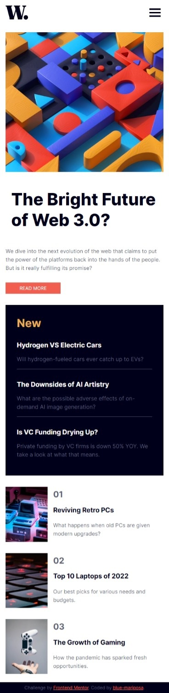
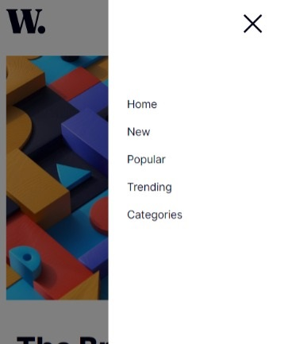
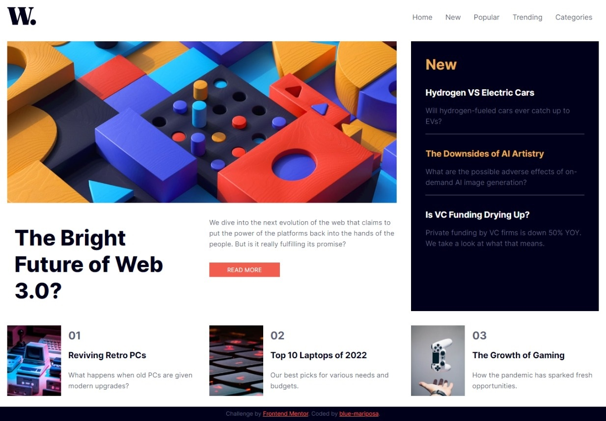
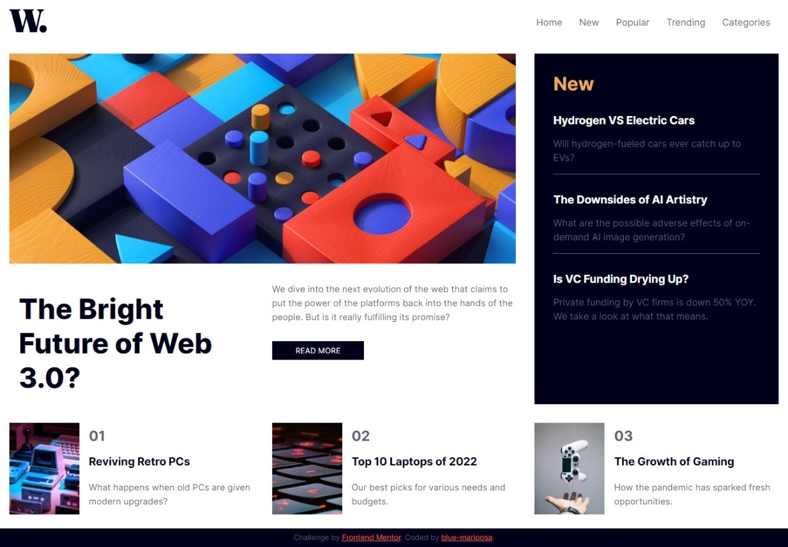

# Frontend Mentor - Product preview card component solution

This is a solution to the [Product preview card component challenge on Frontend Mentor](https://www.frontendmentor.io/challenges/product-preview-card-component-GO7UmttRfa). Frontend Mentor challenges help you improve your coding skills by building realistic projects. 

## Table of contents

- [Overview](#overview)
  - [Screenshot](#screenshot)
- [My process](#my-process)
  - [Built with](#built-with)
  - [What I learned](#what-i-learned)
  - [Continued development](#continued-development)
  - [Useful resources](#useful-resources)
- [Author](#author)
- [Acknowledgments](#acknowledgments)

## Overview

This news homepage chllenge was built with accessibility in mind. Did research on suitable tags and attributes that would be accessible to screen readers. Used Html, CSS & JavaScript. 

### Screenshot









## My process
- Took notes of the requirements of the project and research needed.
- Wrote down the structure and classes i may need. [notes.md](./notes.md)
- Created my folder structure.
  - news-homepage
    - assets
      - js[](./assets/js/news-homepage.js)
      - css [](./assets/css/news-homepage.css)
      - images [](./assets/images/image-gaming-growth.jpg)
      - screenshots [](./screenshots/)
      - fonts [](./assets/fonts/)
    - index.html [](./index.html)
    - readme.md [](./README.md)
- Created the html.
- Created the css.
  - Imported the Montserrat and Fraunces fonts from google fonts.
  - Used Grid to layout the main content.
  - Used flexbox for the header/navigation and the bottom article inner layout.
  - Created the media query for mobile devices.
- Took screenshots.

## Note: I included the fonts offline because i donot have constant access to the internet. However, i have commented out the CSS font-face and included the google font link in the HTML head.     

### Built with

- Semantic HTML5 markup
- CSS custom properties
- Flexbox
- CSS Grid
- JavaScript
- Microsoft Edge
- VS-Code

### What I learned

- Ways of positioning content using css grid.
- how to manipulate text in the DOM.

# Code i'm proud of
```html
<picture class="display-image">
    <source media="(max-width: 768px)" srcset="./assets/images/image-web-3-mobile.jpg">
    
</picture>
```
```css
.related-news:nth-of-type(0) {
    grid-column: 1 / 2;
    grid-row: 3 / 4;
}
```
```js
document.onclick = function(event) { 
    if(event.target.id !== "nav-open-btn" && event.target.id !== "nav-close-btn" && event.target.id !== "menu") {
        navigation.classList.remove("show");
        closeBtn.classList.remove("show");
    }
}
```

### Continued development

- Learn more accessiblity features.
- best html elements to use fo a particular project.
- Optimize my css code and javascript code.

### Useful resources

- [Javscript references](https://www.javatpoint.com/javascript-setattribute#:~:text=JavaScript%20setAttribute%28%29%20The%20setAttribute%28%29%20method%20is%20used%20to,new%20attribute%20with%20the%20specified%20name%20and%20value.) - change attribute of HTML element.

## Author

- Frontend Mentor - [@blue-mariposa](https://www.frontendmentor.io/profile/blue-mariposa).

## Acknowledgments

- Thanks to Frontend Mentor for the guide(s) [Link](https://www.frontendmentor.io).
